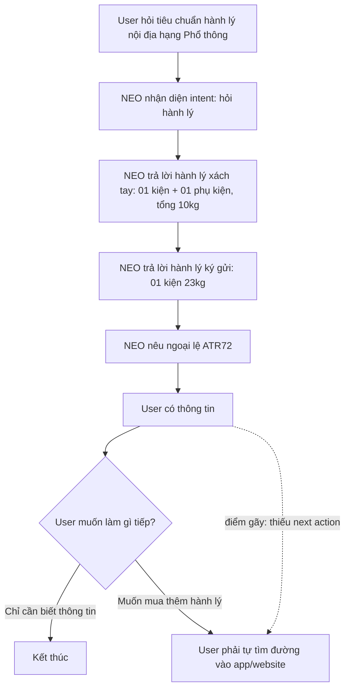
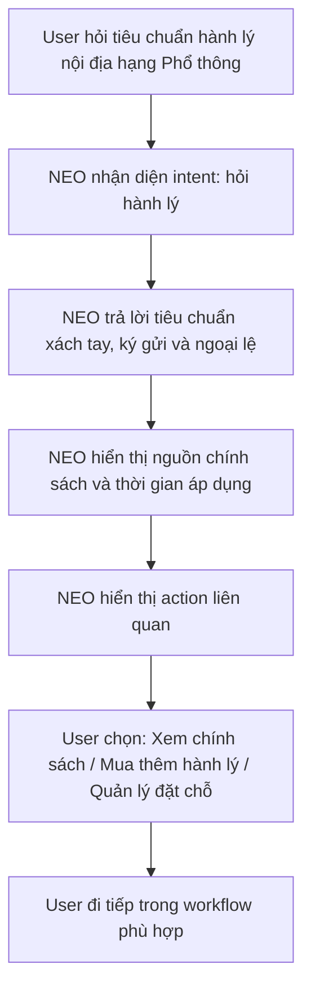
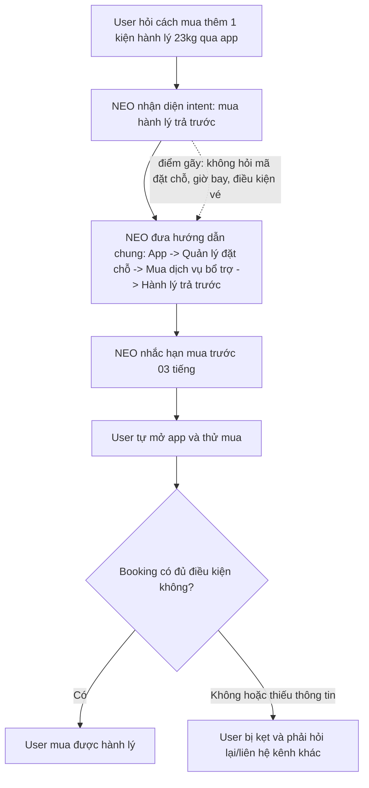
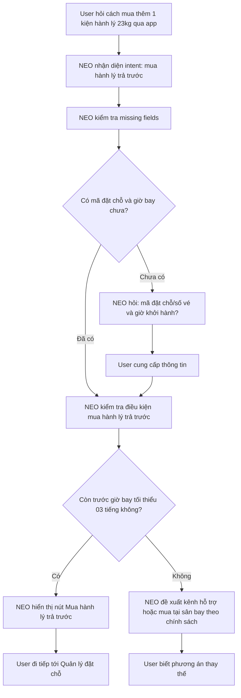
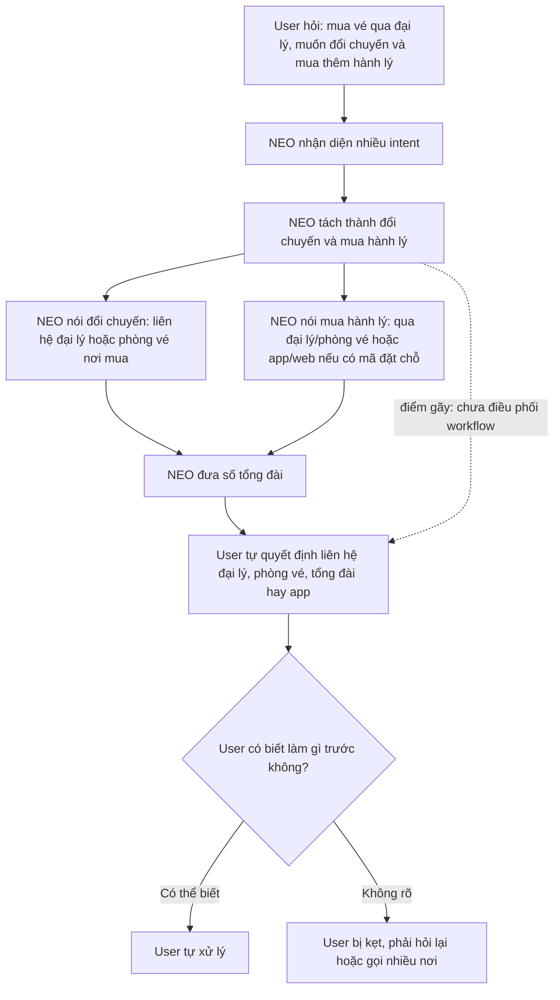
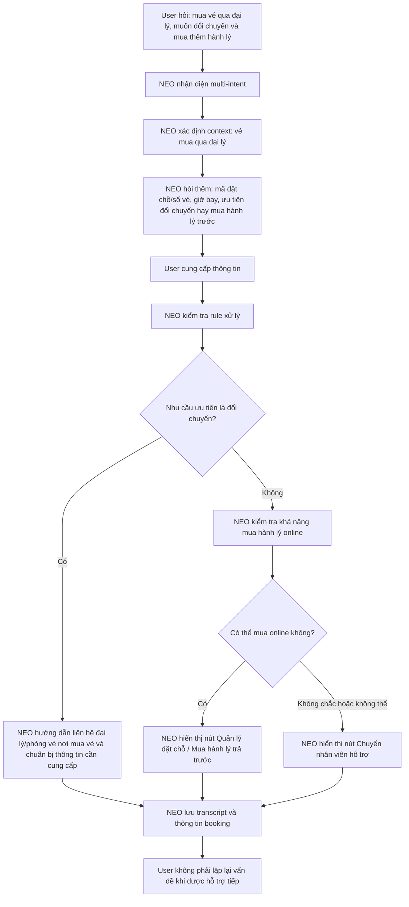
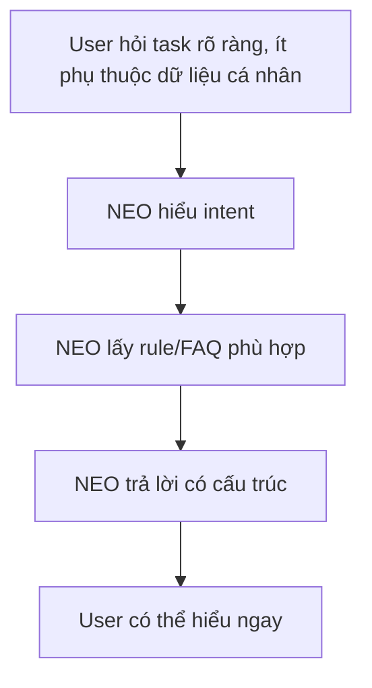
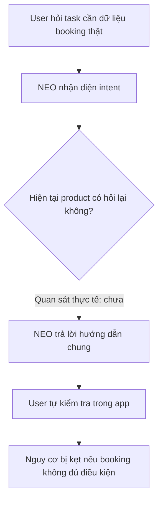
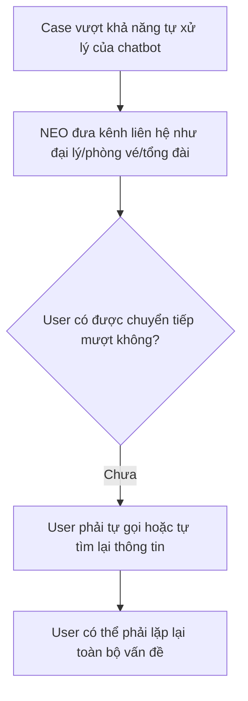
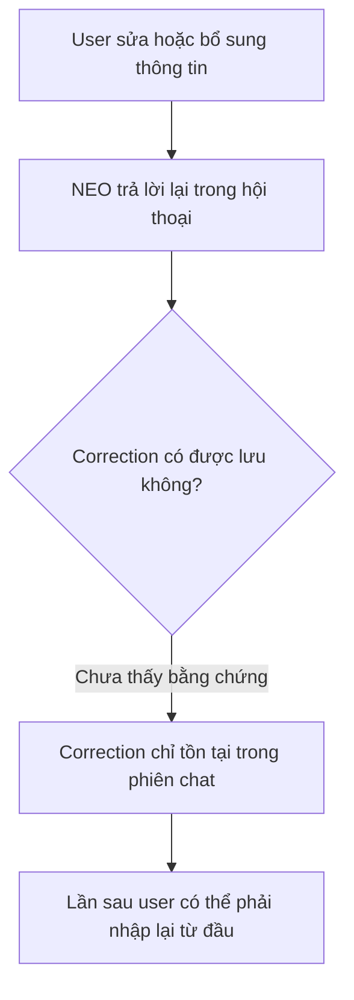

# Workshop — Mổ App AI Thật

**Sản phẩm được chọn:** Vietnam Airlines — NEO  
**AI feature:** Chatbot hỗ trợ thông tin chuyến bay, vé, hành lý, dịch vụ bổ trợ và khiếu nại  
**Thời gian thực hiện:** 35-45 phút  
**Hình thức:** cá nhân trước, chia sẻ theo nhóm sau  
**Output:** finding note + sketch `as-is / to-be`

Mục tiêu không phải chấm "UI đẹp hay xấu". Mục tiêu là dùng sản phẩm thật như một bài needfinding: tìm chỗ product gãy trong workflow thật, rồi viết finding đó thành quyết định product.

---

## 1. Chọn một sản phẩm để dùng thử

| Sản phẩm                   | AI feature                                      | Cách truy cập        |
| -------------------------- | ----------------------------------------------- | -------------------- |
| **Vietnam Airlines — NEO** | **Chatbot hỗ trợ vé, hành lý, khiếu nại**       | **Website/Zalo VNA** |

**Sản phẩm được chọn:** Vietnam Airlines — NEO.

**Lý do chọn:**  
NEO là chatbot nằm trong hành trình thật của khách hàng Vietnam Airlines. Người dùng không chỉ hỏi thông tin chung, mà còn cần xử lý các tình huống có rủi ro cao như hành lý, đổi chuyến, vé mua qua đại lý, thời hạn mua dịch vụ bổ trợ. Vì vậy, kỳ vọng dành cho NEO không chỉ là trả lời FAQ, mà là hỗ trợ người dùng đi tiếp trong workflow thật.

---

## 2. Dùng thử: promise vs reality

### 2.1. Product hứa gì?

NEO được kỳ vọng là trợ lý hỗ trợ khách hàng của Vietnam Airlines, có thể:

* Trả lời nhanh các câu hỏi về hành lý, vé, chuyến bay.
* Hướng dẫn người dùng mua dịch vụ bổ trợ như hành lý trả trước.
* Hỗ trợ các tình huống liên quan đến đổi chuyến, vé mua qua đại lý, phòng vé hoặc tổng đài.
* Điều hướng người dùng đến kênh xử lý phù hợp khi chatbot không tự xử lý được.

### 2.2. User nào được hứa sẽ được giúp?

Nhóm user chính:

* Hành khách đã hoặc sắp mua vé Vietnam Airlines.
* Người cần tra cứu tiêu chuẩn hành lý.
* Người muốn mua thêm hành lý qua app/website.
* Người mua vé qua đại lý và cần đổi chuyến hoặc thêm dịch vụ.
* Người cần hỗ trợ nhanh trước giờ bay.

### 2.3. Kỳ vọng AI làm được task nào?

Tôi kỳ vọng NEO có thể làm tốt các task sau:

1. **Tra cứu tiêu chuẩn hành lý**

   * Trả lời đúng số kiện, số kg.
   * Phân biệt hành lý xách tay và ký gửi.
   * Nêu rõ ngoại lệ nếu có.

2. **Hướng dẫn mua thêm hành lý qua app**

   * Chỉ rõ đường dẫn trong app.
   * Nhắc thời hạn mua hành lý trả trước.
   * Hỏi thêm mã đặt chỗ hoặc điều kiện cần thiết nếu workflow phụ thuộc vào booking thật.

3. **Xử lý case phức tạp: vé mua qua đại lý, muốn đổi chuyến và mua thêm hành lý**

   * Tách đúng nhiều intent trong cùng một câu hỏi.
   * Hỏi lại thông tin thiếu như mã đặt chỗ, giờ bay, kênh mua vé.
   * Đưa nút hành động rõ ràng hoặc handoff sang nhân viên hỗ trợ.

---

## 2.4. Prompt/input đã thử

### Query 1 — Tiêu chuẩn hành lý nội địa hạng Phổ thông

```text
Tôi bay nội địa Vietnam Airlines hạng phổ thông thì được mang bao nhiêu kg hành lý xách tay và ký gửi?
```

### Query 2 — Mua thêm 1 kiện hành lý 23kg qua app

```text
Tôi bay từ TP.HCM đi Hà Nội ngày mai, muốn mua thêm 1 kiện hành lý 23kg thì làm trong app như thế nào?
```

### Query 3 — Vé mua qua đại lý, muốn đổi chuyến và mua thêm hành lý

```text
Tôi mua vé qua đại lý, giờ muốn đổi chuyến và mua thêm hành lý, NEO xử lý giúp tôi được không?
```

---

## 2.5. Hành vi quan sát được

### Observation 1 — Query tiêu chuẩn hành lý

NEO trả lời đối với hành trình nội địa Việt Nam do Vietnam Airlines khai thác:

* Hành lý xách tay: 01 kiện hành lý và 01 phụ kiện.
* Tổng trọng lượng hành lý xách tay không quá 10kg, áp dụng cho vé xuất từ ngày 05/05/2025.
* Ngoại lệ: chặng bay khai thác bởi tàu bay ATR72 có tiêu chuẩn hành lý xách tay là 07kg.
* Hành lý ký gửi: 01 kiện 23kg.

**Điểm gãy:** Không nghiêm trọng. Đây là happy path tốt. Tuy nhiên, sau câu trả lời chưa có nút hành động tiếp theo như "Mua thêm hành lý" hoặc link nguồn chính sách.

---

### Observation 2 — Query mua thêm hành lý qua app

NEO hướng dẫn người dùng:

1. Truy cập ứng dụng di động Vietnam Airlines.
2. Vào mục **Quản lý đặt chỗ**.
3. Chọn mục **Mua dịch vụ bổ trợ**.
4. Chọn **Hành lý trả trước** để hoàn tất việc mua thêm kiện hành lý 23kg.

NEO cũng nhắc rằng cần mua hành lý trả trước muộn nhất 03 tiếng trước giờ khởi hành và mua qua app sẽ tiết kiệm chi phí hơn mua tại sân bay.

**Điểm gãy:** NEO trả lời đúng hướng dẫn chung, nhưng chưa kiểm tra context thật của user như mã đặt chỗ, điều kiện vé, giờ bay, hoặc vé có mua được hành lý online không. User vẫn phải tự vào app và tự phát hiện nếu không mua được.

---

### Observation 3 — Query vé mua qua đại lý, đổi chuyến và mua thêm hành lý

NEO phân tách vấn đề thành 2 phần:

* Đổi chuyến bay: liên hệ trực tiếp đại lý hoặc phòng vé nơi đã mua vé.
* Mua thêm hành lý: có thể mua tại phòng vé/đại lý, hoặc mua online qua website/app nếu có mã đặt chỗ.

NEO cũng nhắc thời hạn mua hành lý trả trước muộn nhất 03 tiếng trước giờ khởi hành và đưa số Trung tâm Chăm sóc Khách hàng:

* Tại Việt Nam: 1900 1100.
* Từ nước ngoài: +84 24 38320320.

**Điểm gãy:** NEO hiểu đúng thông tin, nhưng chưa điều phối workflow. Với một case có nhiều bên liên quan, NEO chỉ đưa danh sách kênh xử lý, chưa hỏi thông tin thiếu, chưa có nút hành động, chưa handoff kèm transcript. User vẫn phải tự quyết định nên làm gì trước.

---

## 3. Vẽ 4 paths

| Path           | Câu hỏi cần trả lời                                                           | Quan sát trên NEO                                                                                                                   |
| -------------- | ----------------------------------------------------------------------------- | ------------------------------------------------------------------------------------------------------------------------------------ |
| Happy          | Khi AI đúng và tự tin, user thấy gì?                                          | NEO trả lời rõ tiêu chuẩn hành lý: 01 kiện xách tay + 01 phụ kiện, tổng 10kg, ký gửi 01 kiện 23kg, có ngoại lệ ATR72.              |
| Low-confidence | Khi AI không chắc, hệ thống có hỏi lại, show options hoặc chuyển người không? | Chưa rõ. Ở query mua thêm hành lý, NEO đưa hướng dẫn chung nhưng không hỏi mã đặt chỗ, giờ bay, điều kiện vé hoặc kênh mua vé.      |
| Failure        | Khi AI không xử lý được, user biết bằng cách nào và sửa thế nào?              | Với vé mua qua đại lý, NEO chuyển trách nhiệm sang đại lý/phòng vé/tổng đài, nhưng chưa có handoff trực tiếp hoặc bước tiếp theo rõ. |
| Correction     | Khi user sửa, correction có được lưu/log/học lại không hay biến mất?          | Chưa thấy bằng chứng có correction log. Nếu user phải sửa thông tin, khả năng cao correction chỉ nằm trong phiên chat hiện tại.      |

---

# 4. Finding thành quyết định product

## Finding 1 — Happy path tốt nhưng thiếu next action

```text
Khi user hỏi thông tin đơn giản như tiêu chuẩn hành lý,
NEO trả lời đúng và rõ,
nhưng câu trả lời dừng ở mức cung cấp thông tin,
hậu quả là user chưa được dẫn sang hành động tiếp theo nếu muốn mua thêm hành lý hoặc xem chính sách chi tiết.
Lỗi thuộc layer UX Action.
Nên sửa bằng requirement: sau các câu trả lời FAQ có liên quan đến hành động, NEO cần hiển thị next action phù hợp như "Mua thêm hành lý", "Xem chính sách", "Quản lý đặt chỗ".
```

**Product decision:**  
Không cần ưu tiên sửa nội dung FAQ hành lý vì NEO đã trả lời tốt. Cần bổ sung **contextual next action** sau câu trả lời để biến thông tin thành hành động.

---

## Finding 2 — Low-confidence path chưa hỏi lại khi thiếu context

```text
Khi user hỏi cách mua thêm hành lý qua app,
NEO đưa hướng dẫn chung ngay,
nhưng không hỏi mã đặt chỗ, giờ bay, hạng vé hoặc kênh mua vé,
hậu quả là user có thể làm theo nhưng bị kẹt nếu booking không đủ điều kiện hoặc đã sát giờ bay.
Lỗi thuộc layer Intent + Data-tool + UX Recovery.
Nên sửa bằng requirement: trước khi hướng dẫn mua dịch vụ bổ trợ, NEO phải kiểm tra missing fields quan trọng hoặc nói rõ đang trả lời theo hướng dẫn chung.
```

**Product decision:**  
NEO nên có cơ chế **clarification before action** cho các task phụ thuộc vào booking thật. Nếu thiếu dữ liệu, NEO cần hỏi lại hoặc yêu cầu user nhập mã đặt chỗ trước khi đưa hướng dẫn cuối cùng.

---

## Finding 3 — Complex path yếu vì chưa điều phối workflow

```text
Khi user mua vé qua đại lý và muốn vừa đổi chuyến vừa mua thêm hành lý,
NEO nhận diện đúng các kênh xử lý,
nhưng chưa giúp user quyết định bước nào làm trước, chưa có nút hành động và chưa handoff kèm transcript,
hậu quả là user vẫn phải tự xoay giữa đại lý, phòng vé, app, website và tổng đài.
Lỗi thuộc layer Workflow Orchestration + UX Recovery + Handoff.
Nên sửa bằng requirement: với multi-intent case, NEO phải tách intent, hỏi context thiếu, ưu tiên việc cần làm trước và cung cấp action/handoff rõ ràng.
```

**Product decision:**  
NEO cần được thiết kế như một **task-orchestration assistant**, không chỉ là chatbot trả lời FAQ. Với các case có nhiều bên xử lý, NEO phải điều phối bước tiếp theo cho user.

---

# 5. Sketch as-is / to-be

## 5.1. Flow 1 — Hỏi tiêu chuẩn hành lý nội địa

### As-is



### To-be



---

## 5.2. Flow 2 — Mua thêm hành lý qua app

### As-is



### To-be



---

## 5.3. Flow 3 — Vé mua qua đại lý, đổi chuyến và mua thêm hành lý

### As-is



### To-be



---

# 6. Tổng hợp 4 paths cho NEO

## 6.1. Happy path



**Ví dụ quan sát:**  
Trong query hành lý nội địa hạng Phổ thông, NEO trả lời rõ số kiện, số kg và ngoại lệ ATR72.

---

## 6.2. Low-confidence path



**Vấn đề:**  
Low-confidence path chưa được thể hiện rõ. NEO chưa có thói quen hỏi: "Vui lòng cung cấp mã đặt chỗ hoặc giờ bay để tôi kiểm tra hướng xử lý phù hợp."

---

## 6.3. Failure path



**Vấn đề:**  
Failure path hiện tại mới dừng ở mức đưa kênh liên hệ. Chưa có handoff, chưa có ticket, chưa có transcript.

---

## 6.4. Correction path



**Vấn đề:**  
Chưa thấy correction log hoặc cơ chế lưu context rõ ràng. Với các case như đổi chuyến/mua hành lý, nếu user đã cung cấp mã đặt chỗ và nhu cầu, thông tin đó nên được lưu để chuyển sang nhân viên hỗ trợ.

---

# 7. Finding note cuối cùng

## Finding chính

```text
Khi user hỏi NEO các task có liên quan đến booking thật như mua thêm hành lý, đổi chuyến hoặc vé mua qua đại lý,
NEO thường trả lời đúng về mặt thông tin nhưng dừng ở hướng dẫn chung,
hậu quả là user vẫn phải tự quyết định bước tiếp theo, tự kiểm tra điều kiện vé và có thể phải lặp lại vấn đề khi liên hệ kênh khác.
Lỗi thuộc layer Intent + Workflow Orchestration + UX Recovery + Handoff.
Nên sửa bằng low-confidence/complex path: kiểm tra missing fields, hỏi lại context quan trọng, hiển thị action phù hợp và handoff kèm transcript khi chatbot không tự xử lý được.
```

## Product decision

```text
NEO không nên chỉ tối ưu để trả lời FAQ chính xác hơn.
SPEC cần bổ sung requirement: với các task liên quan đến booking thật, NEO phải thực hiện bước “context check” gồm:
1. xác định intent chính và intent phụ,
2. kiểm tra dữ liệu bắt buộc như mã đặt chỗ, giờ bay, kênh mua vé,
3. hỏi lại hoặc nói rõ đang trả lời theo hướng dẫn chung nếu thiếu dữ liệu,
4. đưa nút hành động trực tiếp hoặc handoff sang nhân viên kèm transcript.
```

---

# 8. SPEC change đề xuất

## Requirement 1 — Missing field detection

```text
NEO must detect missing critical fields before giving final guidance for booking-dependent tasks such as prepaid baggage, flight change, and agency-issued tickets.
```

Ví dụ:

| Task                  | Missing fields cần hỏi                                                 |
| --------------------- | ---------------------------------------------------------------------- |
| Mua thêm hành lý      | mã đặt chỗ/số vé, giờ bay, chặng bay, hạng vé, kênh mua vé             |
| Đổi chuyến            | mã đặt chỗ/số vé, vé mua qua đâu, chuyến hiện tại, chuyến muốn đổi     |
| Vé mua qua đại lý     | tên/kênh đại lý, mã đặt chỗ, nhu cầu ưu tiên, thời gian trước giờ bay  |

---

## Requirement 2 — Contextual next action

```text
After answering a travel-service question, NEO should show relevant next actions instead of ending at plain text.
```

Ví dụ action:

* Quản lý đặt chỗ.
* Mua hành lý trả trước.
* Xem chính sách hành lý.
* Chuyển nhân viên hỗ trợ.
* Gọi Trung tâm Chăm sóc Khách hàng.

---

## Requirement 3 — Handoff with transcript

```text
When NEO cannot resolve a case and sends the user to a human support channel, it should pass along the conversation transcript and collected booking context.
```

Thông tin nên chuyển kèm:

* Intent của user.
* Mã đặt chỗ/số vé nếu user đã cung cấp.
* Giờ bay hoặc chặng bay.
* User đã thử bước nào.
* Lý do chatbot không tự xử lý được.

---

## Requirement 4 — Correction loop

```text
NEO should provide structured correction actions after uncertain or high-impact answers.
```

Nút/action cần có:

* Sửa thông tin chuyến bay.
* Sửa mã đặt chỗ.
* Tôi mua vé qua kênh khác.
* Chuyển nhân viên.
* Báo câu trả lời chưa giải quyết được vấn đề.

---

# 9. Tự kiểm trước khi nộp

- [x] Có ít nhất 1 screenshot hoặc observation cụ thể.
- [x] Có đủ 4 paths hoặc nói rõ path nào chưa có trong product.
- [x] Finding được viết thành product decision, không chỉ là nhận xét.
- [x] Sketch có as-is và to-be.
- [x] Có một câu nói rõ finding này sẽ đổi gì trong SPEC.
